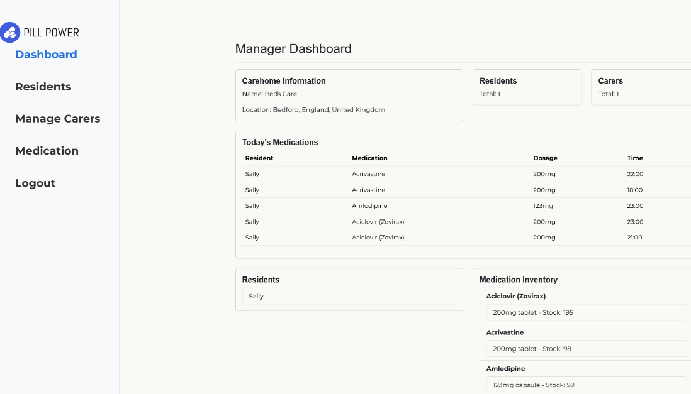
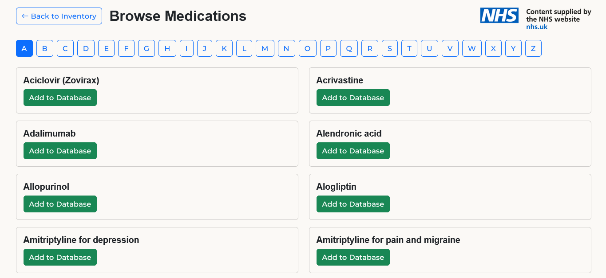
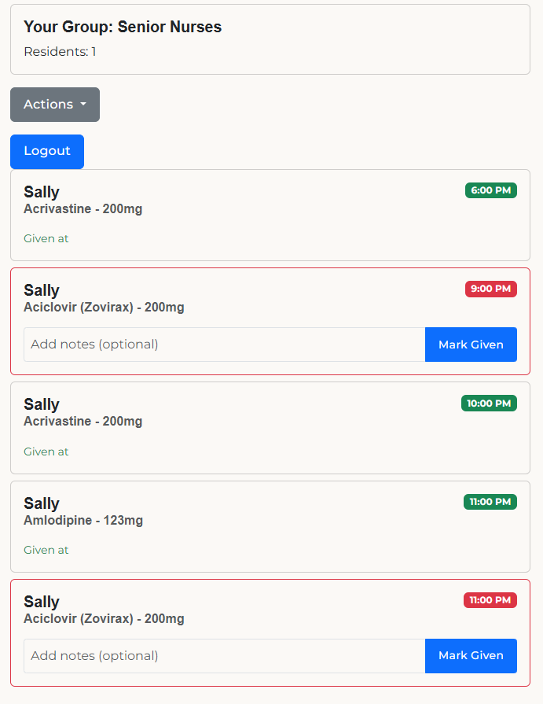

# MedTracker


MedTracker is a full-stack medication-management prototype for residential care homes, presented as **PillPower** in the user interface. I developed it for my A-Level Computer Science NEA, where it scored **60/70**.

The project explores how managers and carers can coordinate resident medication schedules, inventory and administration records while keeping access separated by organisation, role and permission.

> **Educational prototype:** this project has not been clinically validated or independently security-audited. It must not be used for real medication decisions or to store real patient data.

[Watch the project demonstration](https://youtu.be/F90F-cDpiBM) · [Read the sanitised technical report](docs/original-technical-report.pdf)

## What it does

- Provides separate manager and carer registration and dashboard flows
- Uses expiring, single-use invitation codes to associate carers with a care home
- Organises residents and carers into colour-coded care groups
- Gives managers granular control over carer permissions and access duration
- Searches a medication catalogue through the NHS website content API
- Tracks medication variants, stock levels and configurable reorder thresholds
- Creates resident medication schedules with multiple administration times
- Prioritises upcoming medication using a merge-sort-based scheduling utility
- Records who administered medication, when it was given and any care notes
- Filters the medication administration audit log by date
- Generates downloadable PDF Medication Administration Record (MAR) charts

## Screenshots

### Manager dashboard



### NHS medication search



### Carer dashboard



All screenshots contain synthetic demonstration data.

## Architecture

MedTracker uses a three-tier client-server architecture:

```text
Browser
  │  Django templates, Bootstrap, JavaScript and periodic AJAX updates
  ▼
Django application
  │  Views, forms, authentication, custom permission decorators and utilities
  ▼
PostgreSQL
     Relational storage accessed through the Django ORM
```

PostgreSQL was selected as a core part of the design for transactional integrity, concurrency and a clear path beyond a single-user prototype. The data model separates users, care homes, carers, residents, groups, medication, inventory variants, schedules, administration times and logs through explicit relationships.

## Access control and privacy design

The application was designed with data-minimisation, access-control and pseudonymisation principles in mind; this is not a claim of GDPR compliance.

- Django authentication and password hashing protect user credentials.
- Managers and carers have distinct application roles.
- Carers can be limited to an assigned resident group.
- A custom decorator enforces permissions for editing residents and medication, viewing inventory and adjusting stock.
- Care-home association checks reduce cross-organisation data access.
- CSRF protection is applied to state-changing forms.
- Administration logs provide accountability for medication events.
- Database relationships use internal identifiers rather than duplicating personal information.

The original evaluation identifies further work needed for a production system, including two-factor authentication, encryption for sensitive database fields, a full security review and stronger operational controls.

## Technology

- Python 3.11
- Django 5.1
- PostgreSQL and the Django ORM
- HTML, CSS, JavaScript, Django templates and Bootstrap 5
- NHS website content API
- ReportLab for PDF MAR generation
- `django-cities-light` for UK place data

## Run locally

### Prerequisites

- Python 3.11 or later
- PostgreSQL
- A PostgreSQL role with permission to create and use the project database

### 1. Clone the repository

```bash
git clone https://github.com/zaccmarin/pillpower-medtracker.git
cd pillpower-medtracker
```

### 2. Create a virtual environment and install dependencies

```bash
python3 -m venv .venv
source .venv/bin/activate
python -m pip install --upgrade pip
pip install -r requirements.txt
```

On Windows, activate the environment with `.venv\\Scripts\\activate`.

### 3. Configure PostgreSQL and environment variables

Create the development database:

```bash
createdb pillpower
```

Copy the example configuration, enter your local PostgreSQL credentials, then load it into the shell:

```bash
cp .env.example .env
set -a
source .env
set +a
```

The `.env` file is ignored by Git. `NHS_API_KEY` is only required for medication catalogue search; use your own NHS developer sandbox subscription key.

### 4. Initialise and run the application

```bash
python manage.py migrate
python manage.py cities_light
python manage.py runserver
```

Importing the UK city dataset can take a few minutes. Then open [http://127.0.0.1:8000](http://127.0.0.1:8000), register as a manager and create a care home.

## Project structure

```text
CompSciNEA/       Django project settings and root URL configuration
MedTracker/       Models, forms, views, permissions and utility algorithms
templates/        Server-rendered application pages
static/           Styles and source media assets
media/            Default resident image; local uploads are ignored
docs/             Sanitised NEA report and portfolio screenshots
```

## Verification

With PostgreSQL running and the environment configured:

```bash
python manage.py check
python manage.py makemigrations --check --dry-run
python manage.py test
```

The NEA report includes the original manual and acceptance-testing evidence. Automated test coverage remains an area for improvement.

## Known limitations and future work

- Medication can currently be marked as given, but not explicitly refused or not required with a structured reason.
- Schedules are daily rather than supporting weekly or repeating-day patterns.
- Dashboard updates use 30-second polling rather than WebSockets.
- Two-factor authentication and field-level encryption are not implemented.
- The application has not undergone clinical validation, accessibility testing, penetration testing or a production deployment review.

## Project background

The [technical report](docs/original-technical-report.pdf) is retained as supporting evidence of the original NEA process. It covers requirements analysis, alternatives considered, relational database design, algorithms, implementation, testing and evaluation. The report has been sanitised for publication but otherwise intentionally remains an archived coursework document rather than being rewritten after the fact.
